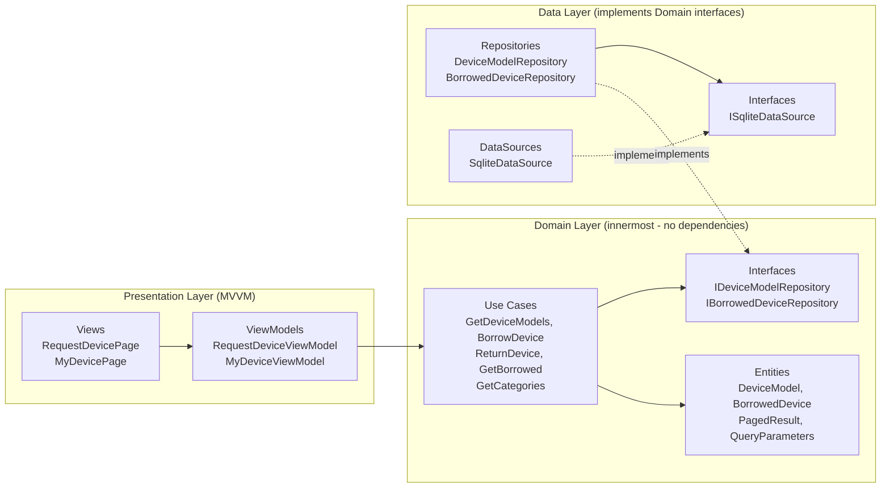
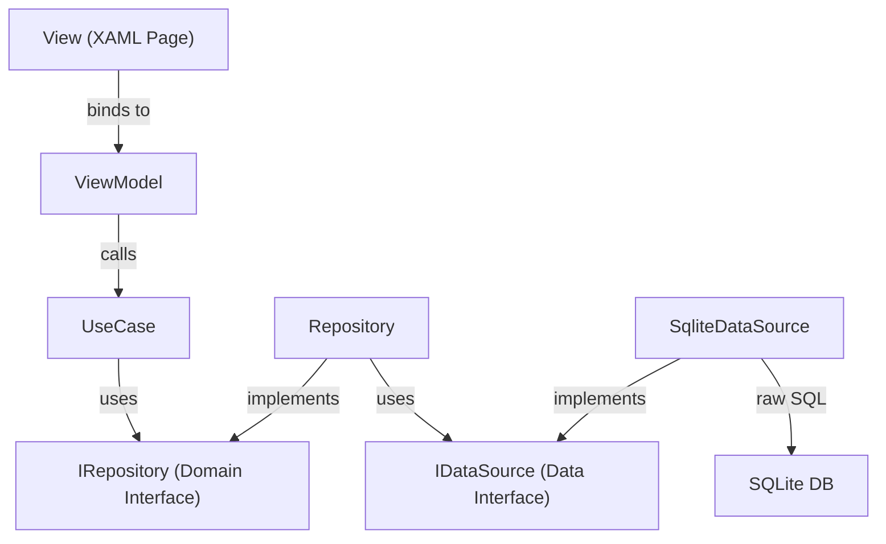
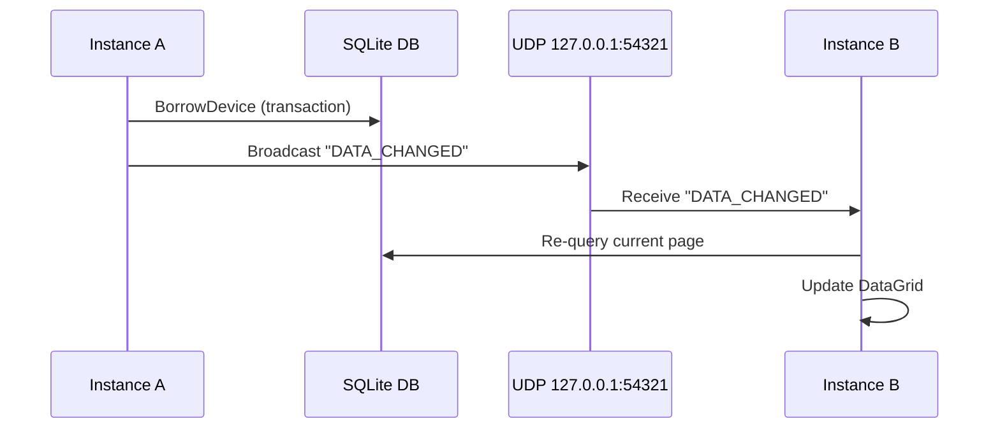
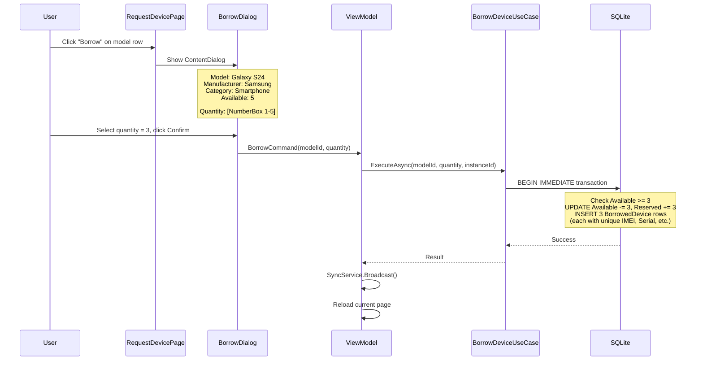
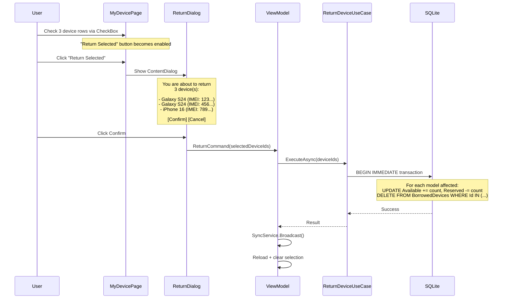

# Device Management System - Clean Architecture Plan

## Clean Architecture Overview



## Dependency Flow



- **Domain Layer**: Zero external dependencies. Defines entities, use case logic, and repository contracts.
- **Data Layer**: Depends on Domain (implements `IRepository`). Contains SQLite-specific code.
- **Presentation Layer**: Depends on Domain (uses entities + use cases). Contains WinUI views and ViewModels.
- **DI Container** in `App.xaml.cs` wires everything together at startup.

## Project Structure

```
HelloWorldWinUI/
│
├── Domain/
│   ├── Entities/
│   │   ├── DeviceModel.cs              # Model, Manufacturer, Category, SubCategory, Available, Reserved
│   │   └── BorrowedDevice.cs           # IMEI, Label, SerialNumber, etc.
│   ├── ValueObjects/
│   │   ├── PagedResult.cs              # Generic PagedResult<T> (Items, TotalCount, Page, PageSize)
│   │   └── QueryParameters.cs          # Filters dict, SortColumn, SortAsc, Page, PageSize
│   ├── Interfaces/
│   │   ├── IDeviceModelRepository.cs   # GetPaged, GetCategories, Borrow, Return
│   │   └── IBorrowedDeviceRepository.cs # GetByInstance, GetPaged
│   └── UseCases/
│       ├── GetDeviceModelsUseCase.cs    # Query warehouse with filter/sort/pagination
│       ├── BorrowDeviceUseCase.cs       # Borrow a device from a model
│       ├── ReturnDeviceUseCase.cs       # Return a borrowed device
│       ├── GetBorrowedDevicesUseCase.cs # Query user's borrowed devices
│       └── GetCategoriesUseCase.cs      # Get distinct Category/SubCategory lists for ComboBox
│
├── Data/
│   ├── Interfaces/
│   │   └── ISqliteDataSource.cs        # ExecuteReader, ExecuteNonQuery, ExecuteScalar, Transaction
│   ├── DataSources/
│   │   └── SqliteDataSource.cs         # SQLite connection, WAL mode, schema init, 1M seed
│   └── Repositories/
│       ├── DeviceModelRepository.cs    # Implements IDeviceModelRepository using ISqliteDataSource
│       └── BorrowedDeviceRepository.cs # Implements IBorrowedDeviceRepository using ISqliteDataSource
│
├── Infrastructure/
│   └── SyncService.cs                  # UDP broadcast send/receive for multi-instance sync
│
├── Presentation/
│   ├── ViewModels/
│   │   ├── RequestDeviceViewModel.cs   # ObservableObject, filter/sort state, pagination, BorrowCommand
│   │   └── MyDeviceViewModel.cs        # ObservableObject, filter/sort state, ReturnCommand
│   └── Views/
│       ├── RequestDevicePage.xaml/.cs   # DataGrid + filter headers + pagination bar
│       └── MyDevicePage.xaml/.cs        # DataGrid + filter headers
│
├── MainWindow.xaml/.cs                 # NavigationView shell + Frame
├── App.xaml/.cs                        # DI container setup, DB init, instance ID
└── HelloWorldWinUI.csproj              # NuGet packages
```

## Database Schema

**DeviceModels** (1,000,000 rows - seeded on first run):

- `Id` INTEGER PRIMARY KEY
- `Model` TEXT (indexed)
- `Manufacturer` TEXT (indexed)
- `Category` TEXT (indexed)
- `SubCategory` TEXT (indexed)
- `Available` INTEGER
- `Reserved` INTEGER

**BorrowedDevices** (created on borrow):

- `Id` INTEGER PRIMARY KEY
- `DeviceModelId` INTEGER FK
- `ModelName`, `IMEI`, `Label`, `SerialNumber`, `CircuitSerialNumber`, `HWVersion` TEXT
- `BorrowedDate`, `ReturnDate` TEXT
- `Invoice`, `Status`, `Inventory` TEXT
- `InstanceId` TEXT

## Layer Details

### Domain Layer

**Entities** - Plain C# classes, no framework dependencies:

```csharp
// Domain/Entities/DeviceModel.cs
public class DeviceModel
{
    public long Id { get; set; }
    public string Model { get; set; }
    public string Manufacturer { get; set; }
    public string Category { get; set; }
    public string SubCategory { get; set; }
    public int Available { get; set; }
    public int Reserved { get; set; }
}
```

**Interfaces** - Repository contracts:

```csharp
// Domain/Interfaces/IDeviceModelRepository.cs
public interface IDeviceModelRepository
{
    Task<PagedResult<DeviceModel>> GetPagedAsync(QueryParameters query);
    Task<List<string>> GetDistinctCategoriesAsync();
    Task<List<string>> GetDistinctSubCategoriesAsync(string? category = null);
    Task<bool> BorrowAsync(long modelId, string instanceId);
}
```

**Use Cases** - Single-responsibility business operations:

```csharp
// Domain/UseCases/GetDeviceModelsUseCase.cs
public class GetDeviceModelsUseCase
{
    private readonly IDeviceModelRepository _repo;
    public GetDeviceModelsUseCase(IDeviceModelRepository repo) => _repo = repo;
    public Task<PagedResult<DeviceModel>> ExecuteAsync(QueryParameters query) 
        => _repo.GetPagedAsync(query);
}
```

### Data Layer

**ISqliteDataSource** - Abstracts raw database access:

```csharp
// Data/Interfaces/ISqliteDataSource.cs
public interface ISqliteDataSource
{
    SqliteConnection GetConnection();
    Task InitializeAsync();  // Create tables, indexes, seed 1M if empty
}
```

**SqliteDataSource** - Handles connection, schema, seeding:

- DB file at `%LOCALAPPDATA%/HelloWorldWinUI/devices.db`
- WAL mode for concurrent multi-instance access
- Creates tables + indexes on `Category`, `SubCategory`, `Manufacturer`, `Model`
- Seeds 1M records in batched transactions (~10-15s first run)

**Repositories** - Build SQL queries with dynamic WHERE/ORDER BY/LIMIT:

```csharp
// Data/Repositories/DeviceModelRepository.cs
public class DeviceModelRepository : IDeviceModelRepository
{
    private readonly ISqliteDataSource _ds;
    
    public async Task<PagedResult<DeviceModel>> GetPagedAsync(QueryParameters q)
    {
        // Build: SELECT ... FROM DeviceModels WHERE [filters] ORDER BY [col] LIMIT @ps OFFSET @off
        // + SELECT COUNT(*) FROM DeviceModels WHERE [filters]
    }
}
```

### Presentation Layer

**ViewModels** - Use `CommunityToolkit.Mvvm` (`ObservableObject`, `RelayCommand`):

```csharp
// Presentation/ViewModels/RequestDeviceViewModel.cs
public partial class RequestDeviceViewModel : ObservableObject
{
    private readonly GetDeviceModelsUseCase _getModels;
    private readonly BorrowDeviceUseCase _borrow;
    private readonly SyncService _sync;

    // Data
    [ObservableProperty] private ObservableCollection<DeviceModel> _items;

    // Pagination state
    [ObservableProperty] private int _currentPage = 1;
    [ObservableProperty] private int _totalPages;
    [ObservableProperty] private int _totalRecords;
    [ObservableProperty] private int _pageSize = 50;
    [ObservableProperty] private ObservableCollection<PageItem> _pageNumbers; // sliding window

    // "Showing X to Y of Z entries" (computed)
    public int ShowingFrom => TotalRecords == 0 ? 0 : (CurrentPage - 1) * PageSize + 1;
    public int ShowingTo => Math.Min(CurrentPage * PageSize, TotalRecords);
    // Bound in XAML: "Showing {ShowingFrom} to {ShowingTo} of {TotalRecords} entries"

    // Navigation button states
    public bool CanGoFirst => CurrentPage > 1;
    public bool CanGoPrevious => CurrentPage > 1;
    public bool CanGoNext => CurrentPage < TotalPages;
    public bool CanGoLast => CurrentPage < TotalPages;

    // Filter properties...

    partial void OnCurrentPageChanged(int value) { OnPropertyChanged(nameof(ShowingFrom)); ... }
    partial void OnPageSizeChanged(int value) { CurrentPage = 1; }

    public void GeneratePageNumbers() { /* sliding window, centered from page 5+ */ }

    [RelayCommand] private async Task LoadDataAsync() { /* query + GeneratePageNumbers */ }
    [RelayCommand] private void GoToFirst() { CurrentPage = 1; }
    [RelayCommand] private void GoToPrevious() { if (CurrentPage > 1) CurrentPage--; }
    [RelayCommand] private void GoToNext() { if (CurrentPage < TotalPages) CurrentPage++; }
    [RelayCommand] private void GoToLast() { CurrentPage = TotalPages; }
    [RelayCommand] private void GoToPage(int page) { CurrentPage = page; }
    [RelayCommand] private async Task ShowBorrowDialogAsync(DeviceModel model)
    {
        // Show ContentDialog with model info + NumberBox (1..model.Available)
        // On confirm: call BorrowDeviceUseCase.ExecuteAsync(model.Id, quantity, instanceId)
        // Then: SyncService.Broadcast() + reload
    }
}

// MyDeviceViewModel additions:
// [ObservableProperty] private ObservableCollection<SelectableDevice> _items; // wraps BorrowedDevice + IsSelected
// public bool HasSelection => Items?.Any(x => x.IsSelected) == true;
// [RelayCommand] private async Task ShowReturnDialogAsync()
// {
//     var selected = Items.Where(x => x.IsSelected).ToList();
//     // Show ContentDialog listing selected devices
//     // On confirm: call ReturnDeviceUseCase.ExecuteAsync(selectedIds)
//     // Then: SyncService.Broadcast() + reload + clear selection
// }

// Helper for pagination bar binding
public class PageItem
{
    public int? PageNumber { get; set; }  // null = ellipsis "..."
    public bool IsCurrent { get; set; }
    public bool IsEllipsis => PageNumber == null;
}
```

**Views** - XAML pages with DataGrid, reuse existing column header template pattern from [MainWindow.xaml](MainWindow.xaml) lines 29-127.

## Multi-Instance Sync



- `SyncService` uses `UdpClient` with `SO_REUSEADDR` for multiple listeners on same port
- Each instance both sends and receives on the same multicast/broadcast address
- On receiving notification, ViewModel re-executes its current query

## Pagination System

### Pagination Bar Layout

Matches the reference design (see `assets/` image):

```
Showing 1 to 10 of 300 entries       [First] [Previous] (1) (2) (3) (4) (5) [Next] [Last]
                                                          ^^^
                                                    current page highlighted

                                      Rows per page: [50 v]
```

**Left side**: `Showing {startRow} to {endRow} of {totalRecords} entries`

- `startRow` = (currentPage - 1) * pageSize + 1
- `endRow` = min(currentPage * pageSize, totalRecords)
- `totalRecords` = total count from SQL COUNT query

**Right side**: Navigation buttons + circular page number buttons

- `[First]` - go to page 1 (disabled when on page 1)
- `[Previous]` - go to currentPage - 1 (disabled when on page 1)
- Page number buttons in circles - current page has filled/dark background
- `[Next]` - go to currentPage + 1 (disabled when on last page)
- `[Last]` - go to last page (disabled when on last page)

**Below / inline**: `Rows per page: [ComboBox]` to select page size

### Sliding-Window Page Numbers

When there are many pages, the pagination bar shows a sliding window of page buttons (max 5 visible). From page 5 onward, the current page is centered in the window:

- Page 1 selected (30 total): `(1) (2) (3) (4) (5) ... (30)`
- Page 3 selected: `(1) (2) (3) (4) (5) ... (30)`
- Page 5 selected: `(1) ... (3) (4) (5) (6) (7) ... (30)`
- Page 15 selected: `(1) ... (13) (14) (15) (16) (17) ... (30)`
- Page 29 selected: `(1) ... (26) (27) (28) (29) (30)`

Logic in ViewModel (`GeneratePageNumbers` method):

```csharp
// maxVisible = 5, half = 2
// windowStart/windowEnd calculated based on currentPage position
// Always show page 1 and lastPage; use "..." ellipsis when gap exists
```

### Configurable Page Size (Rows per page)

A `ComboBox` lets users select how many rows to display per page:

- Options: `10, 25, 50, 100`
- Default: `50`
- On change: resets to page 1, re-queries with new `LIMIT`
- Bound to `ViewModel.PageSize` property
- "Showing X to Y" text updates accordingly

### Pagination in QueryParameters

`QueryParameters.PageSize` is dynamic (from ComboBox selection), `QueryParameters.Page` is 1-based. SQL uses:

```sql
SELECT ... FROM DeviceModels WHERE [filters] ORDER BY [col] LIMIT @pageSize OFFSET (@page - 1) * @pageSize
```

### Page Number Button Styling

Page buttons rendered as circular buttons using WinUI `Button` with a `CornerRadius="16"` style:

- Normal state: transparent background, dark text
- Current page: dark/accent filled background, white text
- Hover: light accent background

## Performance Strategy (target <= 1s)

- All filter + sort via SQL `WHERE ... ORDER BY ... LIMIT @pageSize OFFSET N` -- never load 1M rows into memory
- Indexes on `Category`, `SubCategory`, `Manufacturer`, `Model`
- SQLite WAL mode for concurrent access
- Pagination: configurable 10/25/50/100 rows per page (default 50)
- DataGrid renders only visible rows (UI virtualization)

## NuGet Packages to Add

- `Microsoft.Data.Sqlite` - SQLite database access
- `CommunityToolkit.Mvvm` - ObservableObject, RelayCommand, source generators
- `Microsoft.Extensions.DependencyInjection` - DI container for wiring layers

## DI Registration (App.xaml.cs)

```csharp
var services = new ServiceCollection();
// Data Layer
services.AddSingleton<ISqliteDataSource, SqliteDataSource>();
services.AddSingleton<IDeviceModelRepository, DeviceModelRepository>();
services.AddSingleton<IBorrowedDeviceRepository, BorrowedDeviceRepository>();
// Domain Layer - Use Cases
services.AddTransient<GetDeviceModelsUseCase>();
services.AddTransient<BorrowDeviceUseCase>();
services.AddTransient<ReturnDeviceUseCase>();
services.AddTransient<GetBorrowedDevicesUseCase>();
services.AddTransient<GetCategoriesUseCase>();
// Infrastructure
services.AddSingleton<SyncService>();
// Presentation
services.AddTransient<RequestDeviceViewModel>();
services.AddTransient<MyDeviceViewModel>();
```

## UI Design

### Page 1: Request Device

- DataGrid with 7 columns, inline filter controls in 2-row column headers
- Filters: Model (TextBox), Manufacturer (TextBox), Category (ComboBox), Sub Category (ComboBox)
- Function column: "Borrow" button per row (disabled if Available == 0)
- Pagination bar with sliding-window page numbers (current page centered from page 5+)
- ComboBox to select rows per page: 10 / 25 / 50 / 100
- Sort by clicking column header title area

### Page 2: My Device

- DataGrid with 13 columns (checkbox + 12 data columns)
- First column: **CheckBox** for row selection (header CheckBox toggles select all/none)
- Filter by Model Name (TextBox), Status (ComboBox)
- **"Return Selected" button** above/below DataGrid (enabled when >= 1 row checked)
- Pagination bar with sliding-window page numbers + rows-per-page ComboBox
- Sort by clicking column headers

## Borrow / Return Flows

### Borrow Flow (with Quantity Dialog)



**Borrow Dialog (ContentDialog)** contents:

- Title: "Borrow Device"
- Model info display: Model name, Manufacturer, Category, Sub Category
- Available count display (read-only)
- **NumberBox** for quantity selection: min=1, max=Available, step=1
- Primary button: "Confirm" (disabled if quantity < 1 or quantity > Available)
- Secondary button: "Cancel"

When confirmed, the system creates N `BorrowedDevice` records in a single transaction, each with auto-generated IMEI, Serial Number, Label, etc. The `DeviceModel.Available` is decremented by N and `Reserved` incremented by N.

### Return Flow (with Checkbox Selection + Confirmation Dialog)



**Return Confirmation Dialog (ContentDialog)** contents:

- Title: "Return Devices"
- Summary: "You are about to return {N} device(s):"
- List of selected devices (Model Name + IMEI for identification)
- Primary button: "Confirm"
- Secondary button: "Cancel"

**Checkbox selection in My Device page:**

- Each row has a `CheckBox` in the first column
- Header row has a "Select All" `CheckBox` (toggles all visible rows)
- ViewModel tracks `SelectedDevices` (ObservableCollection or HashSet of device IDs)
- "Return Selected" button's `IsEnabled` bound to `SelectedDevices.Count > 0`

### Domain Layer Changes for Quantity Support

```csharp
// Updated interface
public interface IDeviceModelRepository
{
    Task<PagedResult<DeviceModel>> GetPagedAsync(QueryParameters query);
    Task<List<string>> GetDistinctCategoriesAsync();
    Task<List<string>> GetDistinctSubCategoriesAsync(string? category = null);
    Task<bool> BorrowAsync(long modelId, int quantity, string instanceId); // quantity added
}

public interface IBorrowedDeviceRepository
{
    Task<PagedResult<BorrowedDevice>> GetPagedAsync(QueryParameters query);
    Task<bool> ReturnAsync(List<long> deviceIds); // batch return
}
```

## Existing Code Reuse

- Column header `ControlTemplate` with 2-row layout (title + filter) from [MainWindow.xaml](MainWindow.xaml) lines 29-127
- `FilterArea_PointerPressed` handler to prevent sort on filter click
- Alternating row colors pattern
- Sort direction toggle logic
