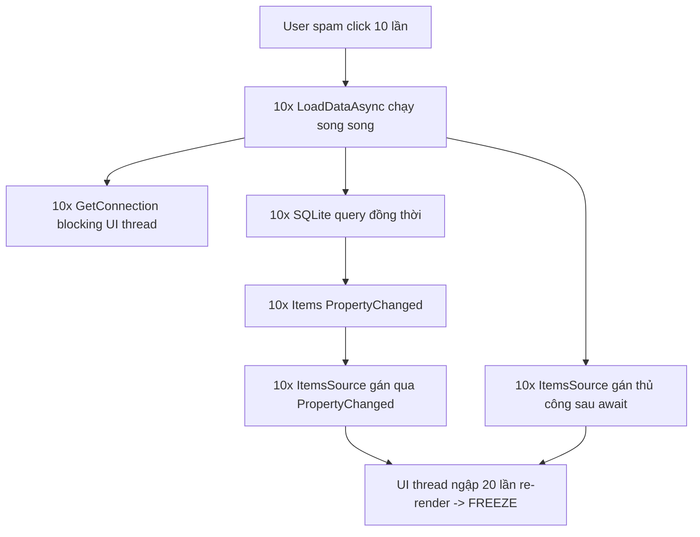
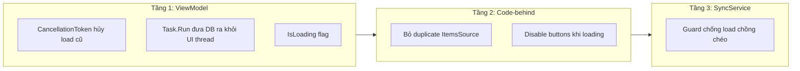

# Khắc phục UI đơ cứng khi spam tương tác

## Bối cảnh vấn đề

Khi user spam click, mỗi click tạo 1 `LoadDataAsync()` chạy đồng thời. 10 click = 10 lần mở SQLite connection (block UI thread), 10 lần query, 20 lần re-render DataGrid (do gán `ItemsSource` 2 lần/load). UI thread bị ngập -> đơ.




## Chiến lược sửa: 3 tầng bảo vệ




---

## Thay đổi chi tiết

### 1. ViewModels - Thêm concurrency guard + offload DB khỏi UI thread

**Files:** [RequestDeviceViewModel.cs](App1/Presentation/ViewModels/RequestDeviceViewModel.cs), [MyDeviceViewModel.cs](App1/Presentation/ViewModels/MyDeviceViewModel.cs)

Thay đổi cho cả 2 ViewModel theo cùng pattern:

- Thêm field `private CancellationTokenSource? _loadCts;`
- Thêm `[ObservableProperty] private bool _isLoading;`
- Sửa `LoadDataAsync()`:
  - Đầu method: `_loadCts?.Cancel(); _loadCts = new CancellationTokenSource(); var token = _loadCts.Token;`
  - Set `IsLoading = true`
  - Wrap lời gọi DB trong `Task.Run()` để không block UI thread (vì `GetConnection()` là synchronous)
  - Sau `await Task.Run(...)`: check `token.IsCancellationRequested` -> nếu bị cancel thì `return` luôn, không cập nhật state
  - Chỉ cập nhật `Items`, `TotalRecords`, `TotalPages` nếu chưa bị cancel
  - Set `IsLoading = false` trong finally block
- Sửa `OnSyncDataChanged()`: cũng dùng chung `_loadCts` nên load cũ tự động bị cancel

Ví dụ pattern cho `LoadDataAsync` sau khi sửa:

```csharp
[RelayCommand]
public async Task LoadDataAsync()
{
    _loadCts?.Cancel();
    var cts = new CancellationTokenSource();
    _loadCts = cts;

    IsLoading = true;
    try
    {
        var query = new QueryParameters { /* ... build query ... */ };

        var result = await Task.Run(() => _getModels.ExecuteAsync(query));

        if (cts.Token.IsCancellationRequested) return;

        TotalRecords = result.TotalCount;
        TotalPages = result.TotalPages;
        NotifyPaginationProperties();
        GeneratePageNumbers();
        Items = new ObservableCollection<DeviceModel>(result.Items);
    }
    catch (OperationCanceledException) { }
    finally
    {
        if (_loadCts == cts)
            IsLoading = false;
    }
}
```

### 2. Code-behind - Loại bỏ gán ItemsSource trùng lặp + disable buttons

**Files:** [RequestDevicePage.xaml.cs](App1/Presentation/Views/RequestDevicePage.xaml.cs), [MyDevicePage.xaml.cs](App1/Presentation/Views/MyDevicePage.xaml.cs)

**a) Sửa `OnViewModelPropertyChanged`:**

- Khi `Items` thay đổi: gán `ItemsSource` + `UpdatePaginationUI()` (giữ nguyên, đây là nơi DUY NHẤT gán `ItemsSource`)
- Thêm xử lý khi `IsLoading` thay đổi: disable/enable tất cả các nút phân trang và filter controls

```csharp
private void OnViewModelPropertyChanged(object? sender, PropertyChangedEventArgs e)
{
    switch (e.PropertyName)
    {
        case nameof(RequestDeviceViewModel.Items):
            ModelDataGrid.ItemsSource = _vm.Items;
            UpdatePaginationUI();
            break;
        case nameof(RequestDeviceViewModel.IsLoading):
            FirstBtn.IsEnabled = !_vm.IsLoading && _vm.CanGoFirst;
            PrevBtn.IsEnabled = !_vm.IsLoading && _vm.CanGoPrevious;
            NextBtn.IsEnabled = !_vm.IsLoading && _vm.CanGoNext;
            LastBtn.IsEnabled = !_vm.IsLoading && _vm.CanGoLast;
            break;
    }
}
```

**b) Xóa bỏ `ModelDataGrid.ItemsSource = _vm.Items;` và `UpdatePaginationUI();` ở TẤT CẢ các event handler sau `await _vm.LoadDataAsync();`.**

Các handler bị ảnh hưởng trong `RequestDevicePage.xaml.cs` (dòng tương ứng):

- `CategoryComboBox_SelectionChanged` (dòng 113-114)
- `SubCategoryComboBox_SelectionChanged` (dòng 129-130)
- `FilterTextBox_TextChanged` (dòng 159-160)
- `ClearFilter_Click` (dòng 182-183)
- `DataGrid_Sorting` (dòng 227-228)
- `FirstPage_Click` (dòng 532-533)
- `PrevPage_Click` (dòng 539-540)
- `NextPage_Click` (dòng 547-548)
- `LastPage_Click` (dòng 555-556)
- `PageNumber_Click` (dòng 565-566)
- `PageSizeComboBox_SelectionChanged` (dòng 586-587)
- `SetPageSize` (dòng 617-618)
- `Page_Loaded` (dòng 54-55) -- giữ lại gọi ban đầu vì cần khởi tạo

Tương tự cho `MyDevicePage.xaml.cs`.

Sau khi sửa, các handler chỉ còn lại pattern đơn giản:

```csharp
private async void NextPage_Click(object sender, RoutedEventArgs e)
{
    _vm.GoToNextCommand.Execute(null);
    await _vm.LoadDataAsync();
}
```

Tất cả UI update đều được xử lý tự động qua `PropertyChanged`.

**c) Xóa bỏ field `_isLoadingData` vì không cần nữa** -- `IsLoading` ở ViewModel đã thay thế vai trò này.

### 3. Dọn dẹp `Page_Loaded`

`Page_Loaded` cũng gán `ItemsSource` thủ công -- bỏ đi, để `PropertyChanged` handler xử lý. Chỉ giữ lại:

```csharp
private async void Page_Loaded(object sender, RoutedEventArgs e)
{
    await _vm.LoadCategoriesAsync();
    PopulateCategoryComboBox();
    PopulateSubCategoryComboBox();
    await _vm.LoadDataAsync();
    _isLoaded = true;
}
```

---

## Tổng kết files thay đổi


| File                        | Thay đổi                                                                                                           |
| --------------------------- | ------------------------------------------------------------------------------------------------------------------ |
| `RequestDeviceViewModel.cs` | Thêm `_loadCts`, `IsLoading`, sửa `LoadDataAsync`                                                                  |
| `MyDeviceViewModel.cs`      | Thêm `_loadCts`, `IsLoading`, sửa `LoadDataAsync`                                                                  |
| `RequestDevicePage.xaml.cs` | Sửa `PropertyChanged` handler, xóa ~24 dòng gán `ItemsSource`/`UpdatePaginationUI` trùng lặp, xóa `_isLoadingData` |
| `MyDevicePage.xaml.cs`      | Tương tự RequestDevicePage                                                                                         |


