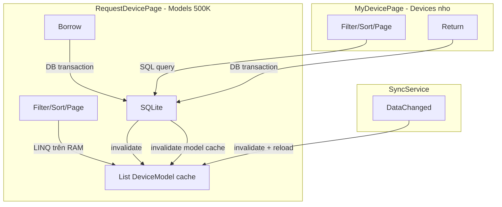

# Refactor: In-memory cache cho Models, chi Borrow/Return truy cap DB

## Tong quan kien truc moi




**Nguyen tac:**

- **Models (500K)**: load 1 lan tu DB vao `List<DeviceModel>`, moi thao tac filter/sort/page dung LINQ (duoi 1s)
- **Devices (My Devices)**: giu SQL query vi dataset nho (chi devices da muon cua instance hien tai)
- **Borrow/Return**: luon truy cap DB, sau do invalidate model cache
- **SyncService**: invalidate cache + reload tu DB

---

## Thay doi chi tiet

### 1. Interface: Them `RefreshCacheAsync` vao `IDeviceModelRepository`

**File:** [IDeviceModelRepository.cs](App1/Domain/Interfaces/IDeviceModelRepository.cs)

Them 1 method:

```csharp
Task RefreshCacheAsync();
```

Interface day du sau khi sua:

```csharp
public interface IDeviceModelRepository
{
    Task<PagedResult<DeviceModel>> GetPagedAsync(QueryParameters query);
    Task<List<string>> GetDistinctCategoriesAsync();
    Task<List<string>> GetDistinctSubCategoriesAsync(string? category = null);
    Task<bool> BorrowAsync(string modelId, int quantity, string instanceId);
    Task RefreshCacheAsync();
}
```

### 2. Viet lai `DeviceModelRepository` voi in-memory cache

**File:** [DeviceModelRepository.cs](App1/Data/Repositories/DeviceModelRepository.cs)

Day la thay doi lon nhat. Viet lai toan bo class:

**a) Them cache fields:**

```csharp
private List<DeviceModel>? _cache;
private readonly SemaphoreSlim _cacheLock = new(1, 1);
```

**b) Them `EnsureCacheAsync()` - lazy load tu DB:**

```csharp
private async Task<List<DeviceModel>> EnsureCacheAsync()
{
    if (_cache != null) return _cache;
    await _cacheLock.WaitAsync();
    try
    {
        if (_cache != null) return _cache;
        _cache = await Task.Run(() => LoadAllFromDb());
        return _cache;
    }
    finally { _cacheLock.Release(); }
}

private List<DeviceModel> LoadAllFromDb()
{
    using var conn = _ds.GetConnection();
    using var cmd = conn.CreateCommand();
    cmd.CommandText = "SELECT Id, Name, Manufacturer, Category, SubCategory, Available, Reserved FROM Models";
    var list = new List<DeviceModel>();
    using var reader = cmd.ExecuteReader();
    while (reader.Read())
    {
        list.Add(new DeviceModel
        {
            Id = reader.GetString(0), Name = reader.GetString(1),
            Manufacturer = reader.GetString(2), Category = reader.GetString(3),
            SubCategory = reader.GetString(4), Available = reader.GetInt32(5),
            Reserved = reader.GetInt32(6)
        });
    }
    return list;
}
```

**c) Viet lai `GetPagedAsync` bang LINQ:**

```csharp
public async Task<PagedResult<DeviceModel>> GetPagedAsync(QueryParameters q)
{
    var all = await EnsureCacheAsync();
    IEnumerable<DeviceModel> filtered = all;

    foreach (var (key, value) in q.Filters)
    {
        if (string.IsNullOrWhiteSpace(value)) continue;
        filtered = key switch
        {
            "Category" => filtered.Where(m =>
                m.Category.Equals(value, StringComparison.OrdinalIgnoreCase)),
            "SubCategory" => filtered.Where(m =>
                m.SubCategory.Equals(value, StringComparison.OrdinalIgnoreCase)),
            "Name" => filtered.Where(m =>
                m.Name.Contains(value, StringComparison.OrdinalIgnoreCase)),
            "Manufacturer" => filtered.Where(m =>
                m.Manufacturer.Contains(value, StringComparison.OrdinalIgnoreCase)),
            _ => filtered
        };
    }

    var filteredList = filtered.ToList();
    var sorted = ApplySort(filteredList, q.SortColumn, q.SortAscending);
    var paged = sorted.Skip((q.Page - 1) * q.PageSize).Take(q.PageSize).ToList();

    return new PagedResult<DeviceModel>
    {
        Items = paged, TotalCount = filteredList.Count,
        Page = q.Page, PageSize = q.PageSize
    };
}
```

`ApplySort` la helper method tra ve `IEnumerable<DeviceModel>` su dung switch tren ten cot + `OrderBy`/`OrderByDescending` voi `StringComparer.OrdinalIgnoreCase` cho string fields.

**d) Viet lai `GetDistinctCategoriesAsync` va `GetDistinctSubCategoriesAsync` bang LINQ:**

```csharp
public async Task<List<string>> GetDistinctCategoriesAsync()
{
    var all = await EnsureCacheAsync();
    return all.Select(m => m.Category).Distinct().OrderBy(c => c).ToList();
}

public async Task<List<string>> GetDistinctSubCategoriesAsync(string? category = null)
{
    var all = await EnsureCacheAsync();
    var query = string.IsNullOrEmpty(category) ? all : all.Where(m => m.Category == category);
    return query.Select(m => m.SubCategory).Distinct().OrderBy(s => s).ToList();
}
```

**e) Sua `BorrowAsync` - giu DB transaction, them invalidate cache:**

Giu nguyen toan bo logic DB transaction hien tai. Chi them 1 dong truoc `return true`:

```csharp
tx.Commit();
_cache = null; // invalidate cache, se reload khi GetPagedAsync duoc goi tiep
return true;
```

**f) Them `RefreshCacheAsync`:**

```csharp
public async Task RefreshCacheAsync()
{
    _cache = null;
    await EnsureCacheAsync();
}
```

### 3. Sua `DeviceRepository` - invalidate model cache sau Return

**File:** [DeviceRepository.cs](App1/Data/Repositories/DeviceRepository.cs)

- **Them dependency** `IDeviceModelRepository` vao constructor (de goi `RefreshCacheAsync` sau Return)
- **Giu nguyen** `GetPagedAsync` (van query DB vi dataset nho)
- **Sua `ReturnAsync`**: sau `tx.Commit()` thanh cong, goi `await _modelRepo.RefreshCacheAsync()` de cap nhat so Available/Reserved trong model cache

```csharp
public class DeviceRepository : IDeviceRepository
{
    private readonly ISqliteDataSource _ds;
    private readonly IDeviceModelRepository _modelRepo;

    public DeviceRepository(ISqliteDataSource ds, IDeviceModelRepository modelRepo)
    {
        _ds = ds;
        _modelRepo = modelRepo;
    }

    // GetPagedAsync: GIU NGUYEN (van query DB)

    public async Task<bool> ReturnAsync(List<string> deviceIds)
    {
        // ... giu nguyen toan bo DB transaction logic ...
        tx.Commit();
        await _modelRepo.RefreshCacheAsync(); // THEM DONG NAY
        return true;
    }
}
```

### 4. Them `RefreshAsync` vao `GetDeviceModelsUseCase`

**File:** [GetDeviceModelsUseCase.cs](App1/Domain/UseCases/GetDeviceModelsUseCase.cs)

Them 1 method:

```csharp
public Task RefreshAsync() => _repo.RefreshCacheAsync();
```

### 5. Sua `RequestDeviceViewModel` - fix SyncService handler

**File:** [RequestDeviceViewModel.cs](App1/Presentation/ViewModels/RequestDeviceViewModel.cs)

Thay doi duy nhat: `OnSyncDataChanged` can refresh cache truoc khi load data:

```csharp
private void OnSyncDataChanged()
{
    _dispatcher?.TryEnqueue(async () =>
    {
        await _getModels.RefreshAsync();
        await LoadDataAsync();
    });
}
```

`LoadDataAsync()` giu nguyen (van co `CancellationToken` guard, `Task.Run`, `IsLoading`). Ly do giu `Task.Run`: lan goi dau tien khi cache rong se load 500K tu DB, can offload khoi UI thread. Cac lan sau cache da co thi `Task.Run` van an toan (LINQ cung chay nhanh tren background thread).

`LoadCategoriesAsync()` va `UpdateSubCategoriesAsync()` **khong can sua** - chung goi repository methods da duoc chuyen sang LINQ.

### 6. Sua `MyDeviceViewModel` - giu nguyen nhung

**File:** [MyDeviceViewModel.cs](App1/Presentation/ViewModels/MyDeviceViewModel.cs)

Khong can thay doi gi. `OnSyncDataChanged` goi `LoadDataAsync()` -> query DB (nho) -> van nhanh. Device data luon tu DB.

### 7. Sua `App.xaml.cs` - DI registration

**File:** [App.xaml.cs](App1/App.xaml.cs)

Khong can thay doi DI registration vi:

- `DeviceModelRepository` da la Singleton (cache ton tai suot vong doi app)
- `DeviceRepository` da la Singleton
- Them `IDeviceModelRepository` vao constructor DeviceRepository -> DI tu resolve (khong vong lap)

Tuy chon: preload model cache sau khi khoi tao DB:

```csharp
var ds = Services.GetRequiredService<ISqliteDataSource>();
await Task.Run(() => ds.InitializeAsync());

var modelRepo = Services.GetRequiredService<IDeviceModelRepository>();
await modelRepo.RefreshCacheAsync(); // preload 500K models vao RAM
```

---

## Hieu nang uoc tinh


| Thao tac                    | Truoc (DB)      | Sau (in-memory LINQ)       |
| --------------------------- | --------------- | -------------------------- |
| Filter 500K models          | ~200-500ms      | ~20-50ms                   |
| Sort 500K models            | ~300-800ms      | ~100-300ms                 |
| Pagination (Skip/Take)      | ~50-100ms       | ~1ms                       |
| Category DISTINCT           | ~100-200ms      | ~30ms                      |
| **Tong (filter+sort+page)** | **~650-1600ms** | **~150-380ms**             |
| Borrow/Return               | ~100-300ms (DB) | ~100-300ms (DB, khong doi) |
| Cache reload (sau write)    | N/A             | ~1-2s (1 lan, background)  |


RAM: ~500K models x ~120 bytes = ~60MB (chap nhan cho desktop app).

---

## Tong ket files thay doi

- [IDeviceModelRepository.cs](App1/Domain/Interfaces/IDeviceModelRepository.cs) -- them `RefreshCacheAsync()`
- [DeviceModelRepository.cs](App1/Data/Repositories/DeviceModelRepository.cs) -- VIET LAI: cache + LINQ
- [DeviceRepository.cs](App1/Data/Repositories/DeviceRepository.cs) -- them dependency `IDeviceModelRepository`, goi `RefreshCacheAsync()` sau Return
- [GetDeviceModelsUseCase.cs](App1/Domain/UseCases/GetDeviceModelsUseCase.cs) -- them `RefreshAsync()`
- [RequestDeviceViewModel.cs](App1/Presentation/ViewModels/RequestDeviceViewModel.cs) -- sua `OnSyncDataChanged`
- [App.xaml.cs](App1/App.xaml.cs) -- tuy chon: preload cache

