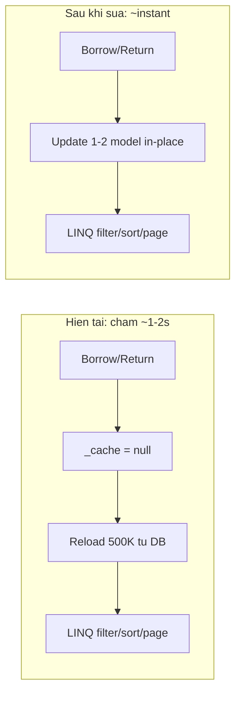

# Optimistic in-place cache update cho Borrow/Return

## Van de hien tai

Sau moi Borrow/Return, toan bo cache 500K records bi invalidate va reload tu DB, mat ~1-2s. Nhung thuc te chi co 1-2 model thay doi `Available`/`Reserved`.




## Giai phap: Optimistic in-place cache update

Thay vi `_cache = null` + reload, cap nhat truc tiep `Available`/`Reserved` cua model trong cache. Chi `RefreshCacheAsync()` (full reload) khi nhan SyncService event tu instance khac.

## Thay doi cu the

### 1. [IDeviceModelRepository.cs](App1/Domain/Interfaces/IDeviceModelRepository.cs)

Them method moi cho in-place update:

```csharp
void UpdateCachedModel(string modelId, int availableDelta, int reservedDelta);
```

### 2. [DeviceModelRepository.cs](App1/Data/Repositories/DeviceModelRepository.cs)

**a) Implement `UpdateCachedModel`:**

```csharp
public void UpdateCachedModel(string modelId, int availableDelta, int reservedDelta)
{
    var model = _cache?.FirstOrDefault(m => m.Id == modelId);
    if (model != null)
    {
        model.Available += availableDelta;
        model.Reserved += reservedDelta;
    }
}
```

**b) Sua `BorrowAsync` (dong 197-198):** thay `_cache = null` bang in-place update:

```csharp
tx.Commit();
UpdateCachedModel(modelId, -deviceIds.Count, +deviceIds.Count);
return true;
```

### 3. [DeviceRepository.cs](App1/Data/Repositories/DeviceRepository.cs)

**Sua `ReturnAsync` (dong 157-158):** thay `await _modelRepo.RefreshCacheAsync()` bang in-place updates:

```csharp
tx.Commit();
foreach (var (modelId, count) in modelCounts)
    _modelRepo.UpdateCachedModel(modelId, +count, -count);
return true;
```

## Khong can thay doi

- **ViewModels**: `LoadDataAsync()` van goi `GetPagedAsync()` -> cache da co gia tri moi -> LINQ chay nhanh
- **SyncService handler**: `OnSyncDataChanged` van goi `RefreshAsync()` (full reload) -- dung vi can lay du lieu tu instance khac
- `**RefreshCacheAsync()`**: giu nguyen cho SyncService dung

## Hieu nang

- **Truoc**: Borrow/Return -> reload 500K tu DB -> ~1-2s delay truoc khi UI cap nhat
- **Sau**: Borrow/Return -> update 1-2 objects in RAM -> ~0ms -> `LoadDataAsync` LINQ tren cache da moi -> ~50-150ms tong

## Tong ket files thay doi

- [IDeviceModelRepository.cs](App1/Domain/Interfaces/IDeviceModelRepository.cs) -- them `UpdateCachedModel()`
- [DeviceModelRepository.cs](App1/Data/Repositories/DeviceModelRepository.cs) -- implement `UpdateCachedModel()`, sua `BorrowAsync` dung in-place update
- [DeviceRepository.cs](App1/Data/Repositories/DeviceRepository.cs) -- sua `ReturnAsync` dung `UpdateCachedModel()` thay vi `RefreshCacheAsync()`

